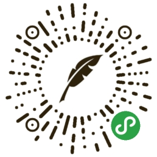

<p align="center">
    
    
</p>
<p align="center">简单，实用的小程序 UI 库</p>

[](https://travis-ci.org/AlanZou007/air-weapp)

## 概述
[air-webapp](https://github.com/AlanZou007/air-weapp) 小程序UI框架，简单， 实用。


组件现已包含actionsheet, button, cell, cell-group, icon, loading, loadmore, panel, popup, rate, stepper, switch, timer, top-tips, upload.




## 目录结构

```
├──  assert         # 静态资源
├──  build          # 构建目录
├──  dist           # 打包结果目录
├──  examples       # 例子
├──  src            # 组件
└──  package.json   # 依赖       
```

## 下载
```bash
 git clone https://github.com/AlanZou007/air-weapp.git
```

## 预览
1. 在 air-weapp 根目录下运行
    ``` bash
    # 安装项目依赖
    npm install
    # 执行组件编译
    npm run dev
    ```
2. 打开[微信web开发者工具](https://mp.weixin.qq.com/debug/wxadoc/dev/devtools/download.html)，'本地小程序项目 - 添加项目'，把 air-weapp/example 目录添加进去就可以预览示例demo了。

## 使用
把项目根目录下的dist目录，复制到项目中。

1. 正常组件

    如按钮组件，只需要在页面中引入按钮自定义组件即可。
    ```json
    {
        "usingComponents": {
            "air-button": "/path/air-weapp/dist/btn/index"
        }
    }
    ```
    ```html
    <!-- example/btn/index.html -->
    <air-button>按钮</air-button>
    ```

2. API类组件

    如 Top-Tips 组件，需要先在页面上引入自定义组件。之后在逻辑运行时，直接调用方法即可展示

    ```json
    {
        "usingComponents": {
            "air-top-tips": "/path/to/zanui-weapp/dist/top-tips/index"
        }
    }
    ```
    ```html
    <air-top-tips id="message" />
    ```

## 开源协议

本项目基于 [MIT](https://zh.wikipedia.org/wiki/MIT%E8%A8%B1%E5%8F%AF%E8%AD%89)协议，请自由地享受和参与开源。

## 贡献

如果你有好的意见或建议，欢迎给我们提 [issue] 或 [PR]，为优化 [Air-Weapp] 贡献力量
